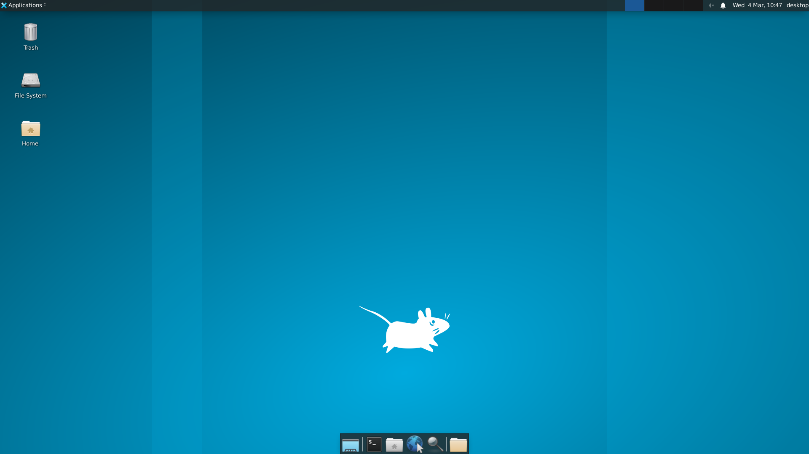

<p align="center">
  
</p>

<h1 align="center">Open-PC</h1>
<p align="center">
  <strong>Give AI Its Own Computer.</strong>
</p>
<p align="center">
  A complete Linux desktop environment, purpose-built for AI agents to see, control, and operate.
</p>

<p align="center">
  <a href="#-what-is-open-pc">What is it?</a> •
  <a href="#-quick-start">Quick Start</a> •
  <a href="#-features">Features</a> •
  <a href="#-use-cases">Use Cases</a> •
  <a href="#-architecture">Architecture</a>
</p>

---

<p align="center">
  <em>Made and maintained by <a href="https://theatechcorporation.com">The A-Tech Corporation PTY LTD</a></em>
</p>

---

## 🎯 What is Open-PC?

**Open-PC is exactly what it sounds like: an open computer that AI can use.**

No more guessing what your AI assistant sees. No more limited APIs. Open-PC gives artificial intelligence a complete, interactive Linux desktop—the same kind you use every day—complete with a graphical interface, web browser, applications, and full input control.

Imagine an AI that can:
- 🖱️ **Click, type, scroll** just like a human user
- 👁️ **See the screen** through real-time video streaming
- 🪟 **Manage windows** and applications
- 📝 **Read text** directly from the display using OCR
- 🌐 **Browse the web** and interact with any website
- ⚡ **Execute commands** in a real terminal

**One purpose: Give AI its own computer.**

---

## 🚀 Quick Start

Get Open-PC running in under 2 minutes:

```bash
# Clone and start
git clone https://github.com/hamishfromatech/open-pc.git
cd open-pc
cp .env.example .env
docker-compose up -d
```

**That's it.** Open your browser to `http://localhost:8092` and watch AI take control.

### Access Points

| Service | URL | Purpose |
|---------|-----|---------|
| **Live Dashboard** | http://localhost:8092 | Watch AI control the desktop in real-time |
| **noVNC Web** | http://localhost:6080 | Browser-based remote desktop view |
| **REST API** | http://localhost:8090 | HTTP endpoints for automation |
| **MCP Server** | http://localhost:8091 | Native AI assistant integration |

Default password: `openpc`

---

## ✨ Features

### 🖥️ Complete Desktop Environment
- Full XFCE4 Linux desktop with GUI applications
- Google Chrome pre-installed and ready to browse
- Terminal, file manager, and system tools
- 1920x1080 resolution (configurable)

### 🤖 AI-First Design
- **MCP (Model Context Protocol)** native support
- Connect Claude, ChatGPT, or any MCP-compatible AI
- 22+ built-in tools for complete desktop control
- Real-time screen streaming at 30 FPS

### 🎮 Real-Time Dashboard
- Live MJPEG video feed of the desktop
- Click anywhere to interact directly
- Execute terminal commands from the web
- Monitor AI activity as it happens

### 🔧 Developer Friendly
- REST API for simple HTTP integration
- WebSocket for real-time bidirectional control
- Comprehensive documentation
- Docker-based for easy deployment

### 🔒 Safe Sandbox
- Isolated Docker container—your real machine stays safe
- Resource limits prevent runaway processes
- Persistent storage for session data
- Health monitoring and auto-restart

---

## 🎬 Use Cases

### AI-Powered Automation
Let AI assistants perform complex GUI tasks that APIs can't handle—filling forms, navigating dashboards, and operating desktop applications just like a human would.

### Automated Testing
Run end-to-end GUI tests in a controlled environment. Take screenshots, verify visual output, and simulate real user interactions.

### AI Research
Provide AI models with a real graphical environment to interact with. Perfect for training agents, testing reasoning, and developing new interaction paradigms.

### Remote Work Automation
Build automation scripts that can interact with any desktop application—legacy software, internal tools, and apps without APIs.

### RPA Development
Develop and test robotic process automation workflows in a safe sandbox before deploying to production.

---

## 🏗️ Architecture

```
┌─────────────────────────────────────────────────────────────────────┐
│                         Open-PC System                               │
├─────────────────────────────────────────────────────────────────────┤
│                                                                      │
│   🌐 Web Dashboard        🤖 MCP Server         🖥️ noVNC Web       │
│   (Port 8092)             (Port 8091)             (Port 6080)       │
│   React + Real-time       FastMCP + SSE           Browser VNC      │
│       │                       │                         │          │
│       └───────────────────────┼─────────────────────────┘          │
│                               │                                     │
│                               ▼                                     │
│               ┌──────────────────────────────┐                       │
│               │    🎛️ Agent Server          │                       │
│               │    FastAPI + WebSocket      │                       │
│               │    • Screenshot API          │                       │
│               │    • Mouse/Keyboard Control │                       │
│               │    • Window Management      │                       │
│               │    • MJPEG Streaming        │                       │
│               └──────────────┬───────────────┘                       │
│                              │                                       │
│                              ▼                                       │
│  ┌────────────────────────────────────────────────────────────────┐ │
│  │         📦 Docker Container (Ubuntu 22.04)                     │ │
│  │  ┌──────────────────────────────────────────────────────────┐  │ │
│  │  │  🖥️ TigerVNC Server                                      │  │ │
│  │  │     • Virtual display 1920x1080                          │  │ │
│  │  │     • XFCE4 Desktop Environment                          │  │ │
│  │  │     • Google Chrome Browser                              │  │ │
│  │  └──────────────────────────────────────────────────────────┘  │ │
│  │  ┌──────────────────────────────────────────────────────────┐  │ │
│  │  │  ⚡ Automation Layer                                      │  │ │
│  │  │     • PyAutoGUI (Mouse/Keyboard)                         │  │ │
│  │  │     • MSS (Fast Screenshots)                              │  │ │
│  │  │     • xdotool/wmctrl (Window Management)                 │  │ │
│  │  │     • Tesseract OCR (Text Extraction)                    │  │ │
│  │  └──────────────────────────────────────────────────────────┘  │ │
│  └────────────────────────────────────────────────────────────────┘ │
└─────────────────────────────────────────────────────────────────────┘
```

---

## 🤝 AI Integration

### MCP Server (Recommended)

Open-PC includes a native **FastMCP server** for seamless integration with AI assistants:

```json
{
  "mcpServers": {
    "open-pc": {
      "type": "streamable-http",
      "url": "http://localhost:8091"
    }
  }
}
```

Once connected, your AI gains these capabilities:

| Category | Available Tools |
|----------|-----------------|
| 👁️ Vision | `take_screenshot`, `get_screen_size` |
| 🖱️ Mouse | `move_mouse`, `click`, `double_click`, `right_click`, `scroll`, `drag` |
| ⌨️ Keyboard | `type_text`, `press_key`, `press_hotkey` |
| 🪟 Windows | `list_windows`, `focus_window`, `close_window`, `maximize_window`, `minimize_window` |
| 📱 Apps | `launch_application`, `open_url`, `run_command` |
| 🔧 Utility | `perform_ocr`, `wait_seconds` |

### REST API

Simple HTTP endpoints for any programming language:

```bash
# Take a screenshot
curl http://localhost:8090/screenshot --output screen.png

# Click somewhere
curl -X POST http://localhost:8090/mouse/click \
  -H "Content-Type: application/json" \
  -d '{"x": 500, "y": 300}'

# Type something
curl -X POST http://localhost:8090/keyboard/type \
  -H "Content-Type: application/json" \
  -d '{"text": "Hello, AI World!"}'

# Open a website
curl -X POST http://localhost:8090/apps/open-url \
  -H "Content-Type: application/json" \
  -d '{"url": "https://github.com"}'
```

---

## ⚙️ Configuration

### Environment Variables

| Variable | Default | Description |
|----------|---------|-------------|
| `VNC_PASSWORD` | `openpc` | Desktop access password |
| `VNC_RESOLUTION` | `1920x1080` | Screen resolution |
| `AUTH_REQUIRED` | `true` | Require WebSocket authentication |

### Ports

| Port | Service |
|------|---------|
| 5901 | Native VNC Server |
| 6080 | noVNC Web Interface |
| 8090 | REST API / WebSocket |
| 8091 | MCP Server (AI) |
| 8092 | Web Dashboard |

---

## 🛡️ Security

Open-PC is designed as a **sandboxed environment**:

- ✅ **Isolated Container** — Runs in Docker, separate from your host system
- ✅ **Network Isolation** — Internal Docker network for service communication
- ✅ **Resource Limits** — CPU and memory constraints prevent runaway processes
- ✅ **Authentication** — Password protection for VNC and WebSocket access
- ✅ **No Host Access** — Container has no access to host filesystem or devices

**Recommended for production:**
- Change the default password
- Run behind a reverse proxy with TLS
- Use network isolation for sensitive deployments

---

## 📦 Tech Stack

| Component | Technology |
|-----------|------------|
| Base OS | Ubuntu 22.04 LTS |
| Desktop | XFCE4 |
| VNC | TigerVNC + noVNC |
| Backend | Python 3 + FastAPI + Uvicorn |
| Automation | PyAutoGUI, MSS, python-xlib |
| MCP | FastMCP with SSE transport |
| Frontend | React 18 + Vite + TypeScript |
| Browser | Google Chrome |

---

## 📄 License

MIT License — Use it, modify it, build on it.

---

## 🙏 Acknowledgments

Open-PC stands on the shoulders of giants:
- [FastMCP](https://gofastmcp.com) — MCP server framework
- [noVNC](https://novnc.com) — Browser VNC client
- [PyAutoGUI](https://pyautogui.readthedocs.io) — Desktop automation
- [FastAPI](https://fastapi.tiangolo.com) — Modern web framework

---

<p align="center">
  <strong>Open-PC</strong><br>
  <em>Because AI deserves its own computer.</em>
</p>

<p align="center">
  Made with ❤️ by <a href="https://theatechcorporation.com">The A-Tech Corporation PTY LTD</a>
</p>